# FASE 2: ARQUITETURA DE COMPONENTES - WHISPO

## 1. DIAGRAMA DE COMPONENTES (Mermaid)

```mermaid
graph TB
    subgraph "SO (Windows/macOS)"
        OSEvents["OS Events<br/>(Keyboard/Microphone)"]
        Clipboard["Clipboard"]
        AppInFocus["Application in Focus"]
    end

    subgraph "Whispo - Rust Native Layer"
        RustCLI["whispo-rs Binary<br/>(Rust executable)"]
        RDEV["rdev crate<br/>(Global hotkey listener)"]
        ENIGO["enigo crate<br/>(Keystroke simulator)"]
        
        RDEV -->|listens| OSEvents
        ENIGO -->|writes to| AppInFocus
        RustCLI -->|spawns| RDEV
        RustCLI -->|spawns| ENIGO
    end

    subgraph "Electron - Main Process"
        Index["index.ts<br/>(App lifecycle)"]
        Window["window.ts<br/>(Window management)"]
        Keyboard["keyboard.ts<br/>(Global hotkey handler)"]
        Config["config.ts<br/>(Config store - JSON)"]
        State["state.ts<br/>(Recording state)"]
        TIPC["tipc.ts<br/>(IPC router - typed)"]
        LLM["llm.ts<br/>(LLM abstraction)"]
        Tray["tray.ts<br/>(System tray)"]
        Updater["updater.ts<br/>(Auto-update)"]
        RendererHandlers["renderer-handlers.ts<br/>(Event types)"]
        
        Index -->|initializes| Window
        Index -->|initializes| Keyboard
        Index -->|initializes| TIPC
        Index -->|initializes| Tray
        Index -->|initializes| Updater
        
        Keyboard -->|calls| RustCLI
        Keyboard -->|updates| State
        Keyboard -->|reads from| Config
        
        Window -->|creates| MainWindow["Main Window<br/>(React app)"]
        Window -->|creates| PanelWindow["Panel Window<br/>(Recording UI)"]
        Window -->|creates| SetupWindow["Setup Window<br/>(First run)"]
        
        TIPC -->|routes| RendererHandlers
        TIPC -->|calls| LLM
        TIPC -->|manages| Config
        
        State -->|observed by| Tray
        
        Tray -->|controls| Window
    end

    subgraph "IPC Bridge (Preload)"
        Preload["preload/index.ts<br/>(contextBridge)"]
        ElectronAPI["electronAPI<br/>(ipcRenderer)"]
        
        Preload -->|exposes| ElectronAPI
    end

    subgraph "Electron - Renderer Process (React)"
        App["App.tsx<br/>(React root)"]
        Router["router.tsx<br/>(React Router v6)"]
        
        Pages["Pages"]
        HistoryPage["pages/index.tsx<br/>(Recording history)"]
        PanelPage["pages/panel.tsx<br/>(Recording capture)"]
        SetupPage["pages/setup.tsx<br/>(First run)"]
        SettingsPages["pages/settings-*.tsx<br/>(Config UI)"]
        
        Components["Components"]
        UI["ui/*.tsx<br/>(Radix UI + Tailwind)"]
        Updater_UI["updater.tsx<br/>(Update checker)"]
        
        Lib["Utilities"]
        Recorder["lib/recorder.ts<br/>(MediaRecorder + AudioContext)"]
        Sound["lib/sound.ts<br/>(Audio playback)"]
        TIPCClient["lib/tipc-client.ts<br/>(IPC client)"]
        EventEmitter["lib/event-emitter.ts<br/>(Pub/Sub)"]
        
        App -->|routes with| Router
        Router -->|renders| Pages
        Pages -->|includes| HistoryPage
        Pages -->|includes| PanelPage
        Pages -->|includes| SetupPage
        Pages -->|includes| SettingsPages
        Components -->|renders| UI
        Components -->|includes| Updater_UI
        
        HistoryPage -->|uses| TIPCClient
        PanelPage -->|uses| Recorder
        PanelPage -->|uses| Sound
        PanelPage -->|uses| TIPCClient
        SetupPage -->|uses| TIPCClient
        SettingsPages -->|uses| TIPCClient
        
        Recorder -->|extends| EventEmitter
        TIPCClient -->|calls| ElectronAPI
        
        RendererHandlers -->|listens via| ElectronAPI
    end

    subgraph "External APIs"
        OpenAI["OpenAI API<br/>(Whisper + GPT)"]
        Groq["Groq API<br/>(Whisper + LLaMA)"]
        Gemini["Google Gemini API<br/>(LLM)"]
    end

    TIPC -->|calls| OpenAI
    TIPC -->|calls| Groq
    TIPC -->|calls| Gemini
    
    TIPC -->|writes text| Clipboard
    TIPC -->|simulates keys via| RustCLI
    
    HistoryPage -->|fetches| TIPC
    PanelPage -->|records audio| OSEvents
    
    style Index fill:#ff6b6b
    style TIPC fill:#ff6b6b
    style Window fill:#ff6b6b
    style RustCLI fill:#8b5cf6
    style PanelPage fill:#4f46e5
    style Recorder fill:#4f46e5
    style TIPCClient fill:#4f46e5
```



---

## 2. TABELA DE RESPONSABILIDADES

| Componente | Arquivo Principal | Responsabilidade | Dependências Críticas | Padrão |
|-----------|-------------------|------------------|----------------------|--------|
| **Electron Lifecycle** | `main/index.ts` | Inicializa app, registra IPC, cria janelas, inicia keyboard listener, tray, updater | `electron`, `@egoist/tipc` | Singleton |
| **Window Management** | `main/window.ts` | Cria/gerencia 3 janelas (main, panel, setup); controla visibilidade; handle close/show | `electron`, `@egoist/electron-panel-window`, `@egoist/tipc` | Factory + Singleton |
| **Global Hotkey Listener** | `main/keyboard.ts` | Escuta eventos de teclado global via processo Rust; dispara recording/stop | `whispo-rs` binary (child process), `main/state`, `main/config` | Observer Pattern |
| **Configuration Store** | `main/config.ts` | Carrega/salva configuração em JSON; persiste em `appData/whispo/config.json` | `fs`, `electron.app` | Singleton Repository |
| **State Management** | `main/state.ts` | Mantém estado global mínimo (`isRecording: boolean`) | — | Singleton Object |
| **IPC Router (Typed)** | `main/tipc.ts` | Define procedimentos RPC tipados; roteia chamadas renderer → main; coordena workflow completo | `@egoist/tipc`, `main/config`, `main/llm`, `main/window`, `main/state` | Router + Service Locator |
| **LLM Abstraction** | `main/llm.ts` | Pós-processa transcrição com LLM; suporta OpenAI, Groq, Gemini com URLs customizadas | `@google/generative-ai`, `fetch`, `main/config` | Strategy Pattern (Provider) |
| **System Tray** | `main/tray.ts` | Cria menu tray; sincroniza ícone com `state.isRecording` | `electron.Menu/Tray`, `main/state`, `main/window` | Singleton + Observer |
| **Auto-update** | `main/updater.ts` | Verifica updates, baixa, instala via `electron-updater` | `electron-updater` | Singleton |
| **Renderer Handlers Types** | `main/renderer-handlers.ts` | Define tipos de eventos que main envia ao renderer (TypeScript only) | — | Type Definition |
| **Preload Bridge** | `preload/index.ts` | Expõe `electronAPI` e `api` globals via `contextBridge` (security isolation) | `electron.contextBridge`, `@electron-toolkit/preload` | Security Bridge |
| **React Root** | `renderer/src/App.tsx` | Renderiza `<RouterProvider>`, lazy-loads `<Updater>` | `react-router-dom` | Component |
| **Router (Navigation)** | `renderer/src/router.tsx` | Define rotas (/, /settings/*, /setup, /panel) com lazy loading | `react-router-dom` | Router Config |
| **History Page** | `renderer/pages/index.tsx` | Exibe lista de gravações; permite replay/delete; chama `tipcClient.getRecordingHistory()` | `tipcClient`, React Query | Page Component |
| **Panel Page (Recording UI)** | `renderer/pages/panel.tsx` | Captura áudio com `Recorder`; exibe visualizador de nível; envia blob ao main | `Recorder`, `Sound`, `tipcClient`, React Query | Page Component |
| **Setup Page** | `renderer/pages/setup.tsx` | Primeira execução; solicita permissões (microphone, accessibility) | `tipcClient` | Page Component |
| **Settings Pages** | `renderer/pages/settings-*.tsx` | Config UI para providers (OpenAI/Groq/Gemini), shortcuts, data management | `tipcClient` | Page Components |
| **Recorder (Audio Capture)** | `renderer/lib/recorder.ts` | Captura áudio via `MediaRecorder` + WebRTC AudioContext; emite frames para visualizador | `EventEmitter`, Web APIs (`MediaRecorder`, `AudioContext`) | EventEmitter + Builder |
| **Sound (Feedback)** | `renderer/lib/sound.ts` | Reproduz WAV de feedback (início/fim gravação) | — | Singleton |
| **IPC Client (Renderer)** | `renderer/lib/tipc-client.ts` | Cliente RPC typado; invoca procedures do main; chama `window.electron.ipcRenderer` | `@egoist/tipc/renderer`, `window.electron` (preload) | Client |
| **Event Emitter** | `renderer/lib/event-emitter.js` | Pub/Sub genérico; estende com tipos em `d.ts` | — | Observer Pattern |
| **Rust CLI** | `whispo-rs/src/main.rs` | Escuta eventos de teclado globalmente (`listen`); simula digitação (`write`) | `rdev`, `enigo` | Executable |
| **rdev (Rust crate)** | `whispo-rs/Cargo.toml` | Captura eventos de teclado/mouse do SO sem raw_input | `rdev = 0.5.3` | Native Binding |
| **enigo (Rust crate)** | `whispo-rs/Cargo.toml` | Simula eventos de teclado (keystroke synthesis) | `enigo = 0.3.0` | Native Binding |

---

## 3. ANÁLISE DE ACOPLAMENTO

### 3.1 Acoplamento TIGHT (Difícil de substituir)

#### **Main Process → Rust Binary**
- **Acoplamento**: `main/keyboard.ts` spawna `whispo-rs` como processo filho, serializa/desserializa eventos JSON via stdout
- **Impacto**: Substituir por outra solução de hotkey (ex: `node-global-key-listener`) requer reescrever lógica em TypeScript
- **Razão**: Rust necessário para acesso nativo de baixo nível (segurança + performance)
- **Avaliação**: ✅ JUSTIFICADO - tradeoff consciente

#### **Renderer → Config via tipc.ts**
- **Acoplamento**: Settings pages fazem chamadas RPC tipadas (`tipcClient.saveConfig()`)
- **Impacto**: Alterar formato de config exige mudança coordenada em main + renderer
- **Avaliação**: ✅ MODERADO - tipos TypeScript forçam consistência

#### **LLM Selection (Strategy Pattern)**
- **Desacoplamento**: `llm.ts` escolhe provider via string (`config.transcriptPostProcessingProviderId`)
- **Acoplamento**: Adicionar novo provider exige modificação em `llm.ts` + tipos em `shared/types.ts`
- **Avaliação**: ⚠️ POSSÍVEL MELHORIA - usar factory com registro de providers

---

### 3.2 Acoplamento LOOSE (Fácil de substituir)

#### **Recorder ↔ Visualizer (Event-Driven)**
- **Desacoplamento**: `Recorder` emite eventos genéricos; `panel.tsx` escuta sem saber implementação
- **Impacto**: Trocar `MediaRecorder` por WebAudio API requer só mudança em `lib/recorder.ts`
- **Avaliação**: ✅ BOM - Observer pattern funciona bem

#### **Sound Playback (Singleton)**
- **Desacoplamento**: `Sound.playSound()` é isolado; fácil mockear em testes
- **Impacto**: Substituir por síntese de áudio requer só mudança em `lib/sound.ts`
- **Avaliação**: ✅ BOM - módulo independente

#### **IPC Communication (Typed Contract)**
- **Desacoplamento**: `@egoist/tipc` cria contrato type-safe entre processos
- **Acoplamento**: Substituir `tipc` por IPC nativo Electron requer reescrever todas as chamadas
- **Avaliação**: ⚠️ MODERADO - tradeoff entre type safety e flexibilidade (vale a pena)

#### **Configuration Persistence**
- **Desacoplamento**: `config.ts` usa JSON simples em filesystem
- **Impacto**: Trocar por SQLite/IndexedDB requer só mudança em `config.ts`
- **Avaliação**: ✅ EXCELENTE - abstração limpa

---

### 3.3 Componentes Facilmente Substituíveis

1. **Sound Library** (`lib/sound.ts`)
   - Dependência: Web Audio API nativa (sem libs)
   - Substituição: Use `Tone.js` ou `Howler.js`

2. **UI Framework** (Radix UI)
   - Atualmente: Radix + Tailwind
   - Substituição: Trocar por shadcn/ui, Chakra, etc. sem afetar lógica

3. **HTTP Client** (Fetch API)
   - Atualmente: Fetch nativo
   - Substituição: Usar `axios`, `ky`, `got` sem afetar fluxos

4. **Router** (React Router v6)
   - Substituição: TanStack Router, Wouter com ajustes mínimos

5. **State Query Library** (React Query)
   - Substituição: SWR, RTK Query, Zustand com refactor moderado

---

### 3.4 Componentes Tightly Coupled (Hard-coded)

1. **Keyboard Listener**
   - Hard-coded: Função `handleEvent()` em `keyboard.ts` contém lógica complexa de máquina de estados
   - Extratos: `isHoldingCtrlKey`, `hasRecentKeyPress()`, timer de 800ms
   - Impacto: Difícil de testar isoladamente; mudanças em UX requerem refactor profundo
   - Recomendação: Extrair máquina de estados para classe separada

2. **Recording Workflow**
   - Hard-coded: Orquestração entre `panel.tsx` → `Recorder` → `tipcClient.createRecording()` → `llm.postProcess()` → clipboard → keystroke
   - Impacto: Adicionar novo step (ex: salvar em cloud) requer modificação em múltiplos arquivos
   - Recomendação: Criar saga/orchestrator pattern

3. **LLM Provider Selection**
   - Hard-coded: Switch/if em `llm.ts` baseado em `config.transcriptPostProcessingProviderId`
   - Impacto: Adicionar provider requer modificação em `llm.ts` + `types.ts`
   - Recomendação: Factory com registro dinâmico

---

## 4. DECISÕES ARQUITETURAIS IDENTIFICADAS

### 4.1 Por que @egoist/tipc ao invés de IPC Nativo Electron?

**IPC Nativo Electron:**
```typescript
ipcMain.handle('create-recording', async (event, data) => {
  // Type é perdido aqui
})
```

**@egoist/tipc:**
```typescript
createRecording: t.procedure
  .input<{ recording: ArrayBuffer; duration: number }>()
  .action(async ({ input }) => { /* ... */ })
```

**Vantagens:**
- ✅ Type safety end-to-end (TypeScript enforced)
- ✅ Autocomplete em chamadas RPC
- ✅ Validação automática de input
- ✅ API remota síncrona/assíncrona transparente
- ✅ Eventos tipados (rendererHandlers)

**Tradeoff:**
- ❌ Dependência externa (mas mantida por egoist, autor confiável)
- ❌ Aprendizado de API customizada

**Conclusão**: ✅ **DECISÃO EXCELENTE** - type safety em IPC é raro e valioso em aplicações complexas

---

### 4.2 Por que Rust para Componentes Nativos?

**Problema**: Capturar hotkeys globais em Windows/macOS requer acesso direto ao OS event loop

**Alternativas Consideradas:**
1. **node-global-key-listener** (Node.js binding)
   - ❌ Menos suporte, bindings complexos, mais bugs relatados
   
2. **robotjs** ou similar
   - ❌ Deprecated, não mantido
   
3. **Electron Menu/Accelerator**
   - ❌ Só funciona com app em foco

**Por que Rust:**
- ✅ `rdev` é maduro, cross-platform (Win/macOS/Linux)
- ✅ Performance sem GC (crítico para event loop global)
- ✅ `enigo` para keystroke synthesis (confiável)
- ✅ Binário compilado isolado = segurança + simplidade

**Tradeoff:**
- ❌ Adiciona complexidade: build Rust, distribuir binary
- ❌ Curva de aprendizado se manutenção necessária

**Conclusão**: ✅ **DECISÃO PRAGMÁTICA** - Rust é overkill se tivesse binding Node.js confiável, mas cumpre papel bem

---

### 4.3 Por que Electron Tri-Processo?

**Arquitetura atual:**
- Main process (Node.js) — orquestração
- Renderer process (React) — UI
- Preload bridge (isolated context)

**Alternativas:**
1. **Monolítico** (tudo em main)
   - ❌ UI bloquearia operações
   
2. **Workers** (Web Workers no renderer)
   - ⚠️ Possível para `Recorder`, mas adiciona complexidade

**Por que tri-processo:**
- ✅ Crash isolation (renderer crashes não matam main)
- ✅ Responsabilidades claras
- ✅ UI nunca bloqueia
- ✅ Preload fornece segurança

**Conclusão**: ✅ **PADRÃO ELETRÔN** - implementação correta

---

### 4.4 Por que JSON Simples para Config?

**Problema**: Persistir configurações (API keys, shortcuts, etc.)

**Alternativas:**
1. **SQLite**
   - ❌ Overkill para ~20 campos
   
2. **IndexedDB**
   - ❌ Renderer-only, requer serialização
   
3. **electron-store**
   - ⚠️ Abstração sobre fs.writeFileSync, talvez melhor
   
4. **JSON Puro**
   - ✅ Simples, legível, portable

**Por que JSON:**
- ✅ Human-readable (debug fácil)
- ✅ Sem dependências
- ✅ Versionamento simples (adicionar campos)
- ✅ Exportar/importar configuração trivial

**Tradeoff:**
- ⚠️ Sem migrations automáticas (mas não necessário ainda)
- ⚠️ Sem validação schema (adicionar zod/yup seria bom)

**Conclusão**: ✅ **FUNCIONA** - mas seria melhor adicionar `zod` para schema validation

---

### 4.5 Orquestração: Main Process é Orchestrator

**Padrão identificado:**

```
Hotkey → Main.keyboard.ts → Main.window.ts → Renderer.panel.tsx → Recorder
                                ↓
                        Main.tipc.ts (router)
                           ↓
                      Whisper API → Main.llm.ts
                           ↓
                      Clipboard + Keystroke
```

**Característica:** Main process é o "maestro"
- Coordena fluxo entre Rust, Renderer, APIs externas
- Não há comunicação direta Renderer ↔ Rust ou Renderer ↔ APIs

**Vantagem:**
- ✅ Auditável (tudo passa por tipc.ts)
- ✅ Segurança (Renderer não pode chamar Rust diretamente)
- ✅ Fácil loggear fluxo completo

**Risco:**
- ⚠️ Main process é SPOF (single point of failure)
- Mitigation: Rare crashes em main (stateless logic)

**Conclusão**: ✅ **PADRÃO CORRETO** para Electron desktop apps

---

## 5. PADRÕES DE DESIGN IDENTIFICADOS

| Padrão | Implementação | Arquivo(s) |
|--------|--------------|-----------|
| **Singleton** | `ConfigStore`, `state`, `recorderRef` | `config.ts`, `state.ts`, `panel.tsx` |
| **Factory** | `createMainWindow()`, `createPanelWindow()` | `window.ts` |
| **Observer/Event-Driven** | `Recorder` emits `record-start/end/visualizer-data` | `lib/recorder.ts`, `panel.tsx` |
| **Strategy (Provider Pattern)** | LLM provider selection (OpenAI vs Groq vs Gemini) | `llm.ts`, `config.ts` |
| **Repository** | `ConfigStore`, `recordingHistory` | `config.ts`, `tipc.ts` |
| **Router/Service Locator** | `tipc.ts` roteia chamadas RPC | `tipc.ts` |
| **Type-Safe RPC** | `@egoist/tipc` | `tipc.ts`, `tipc-client.ts` |
| **Security Bridge** | Preload isolates context | `preload/index.ts` |
| **Lazy Loading** | React Router lazy routes | `router.tsx` |
| **State Machine** | Keyboard event handling (isHoldingCtrlKey, timers) | `keyboard.ts` |

---

## 6. PRÓXIMOS PASSOS

✅ **Análise completada com sucesso**

**Recomendações de Refactoring (não-bloqueantes):**

1. **Extrair máquina de estados de keyboard** (`keyboard.ts`)
   - Classe `KeyboardStateMachine` com transições explícitas

2. **Adicionar factory para LLM providers** 
   - Registry pattern para suportar novos providers facilmente

3. **Adicionar `zod` para validação schema**
   - Validar config.json na carga

4. **Criar saga/orchestrator para recording workflow**
   - Encapsular lógica de coordenação main process

5. **Adicionar tests para Recorder**
   - Mock EventEmitter, simular audio frames

---

## RESUMO EXECUTIVO

**Whispo é arquitetonicamente bem-estruturado:**
- ✅ Separação clara de responsabilidades (main/renderer/rust)
- ✅ Type safety via `@egoist/tipc`
- ✅ Componentes loosely coupled (fácil testar/substituir)
- ✅ Rust para hotkeys é pragmático
- ✅ IPC tipado é diferencialmente melhor que Electron padrão

**Pontos de melhoria:**
- ⚠️ Keyboard handler contém lógica complexa de estado
- ⚠️ LLM selection é hard-coded (factory pattern seria melhor)
- ⚠️ Falta validação schema para configuração

**Nível de Acoplamento Geral**: **MODERADO-BAIXO** (bom para desktop app)
