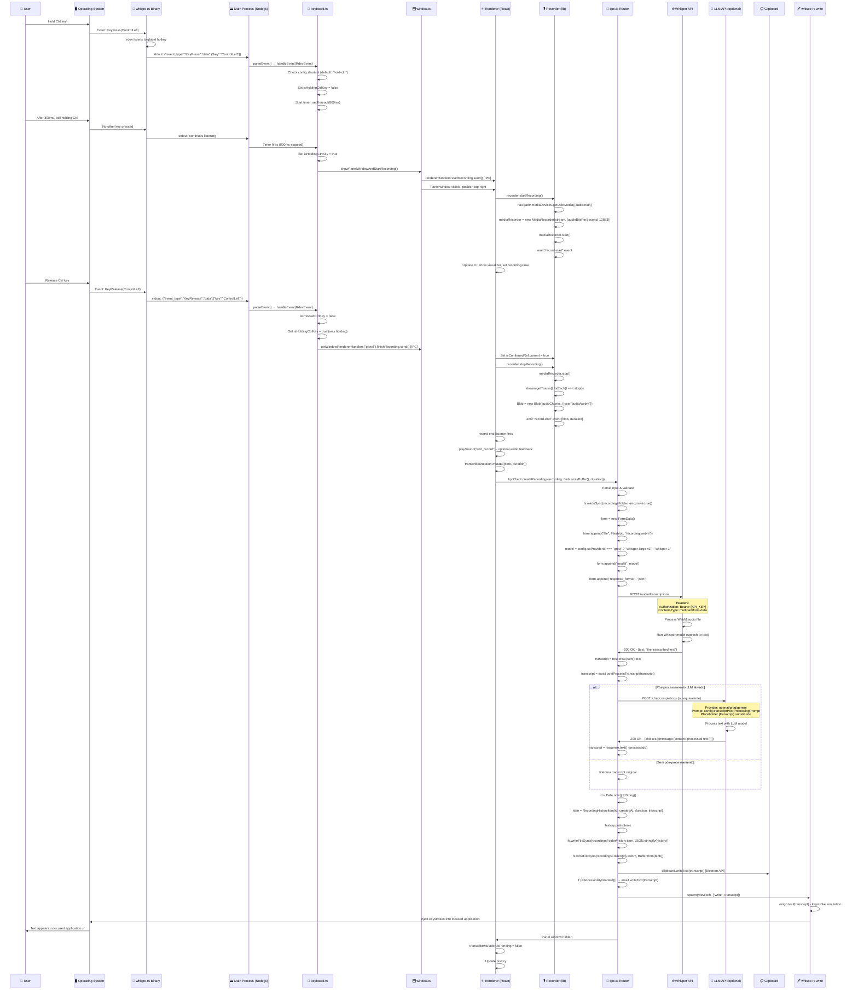
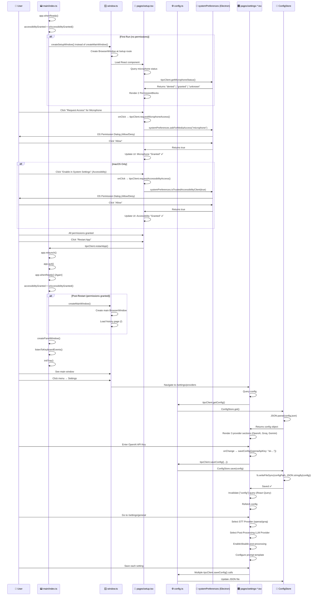
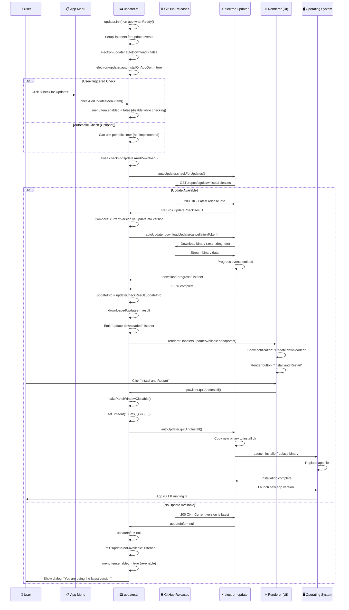

# FASE 3: FLUXOS CRÍTICOS DO WHISPO

## FLUXO 1: GRAVAÇÃO, TRANSCRIÇÃO E INSERÇÃO DE TEXTO

### 1.1 Visão Geral do Fluxo

Este é o fluxo principal que ativa todas as features do Whispo. Começa quando o usuário segura a tecla Ctrl, passa por captura de áudio via MediaRecorder API, transcrição via Whisper (OpenAI ou Groq), pós-processamento opcional com LLM, e finaliza com inserção automática do texto no aplicativo em foco.

**Pontos-chave**:
- Hotkey detection via Rust nativo (`whispo-rs` + `rdev`)
- Gravação de áudio com MediaRecorder API (formato WebM, 128kbps)
- Orquestração completa no Main Process (Node.js)
- IPC tipado entre Renderer e Main (@egoist/tipc)
- APIs externas: Whisper + LLM (OpenAI, Groq, Gemini)
- Inserção via clipboard + simulação de teclado (Rust/enigo)

### 1.2 Diagrama de Sequência Completo



### 1.3 Pseudocódigo das Funções Principais

#### **1.3.1 keyboard.ts - listenToKeyboardEvents()**

```pseudocode
function listenToKeyboardEvents():
    child = spawn(rdevPath, ["listen"])
    
    child.stdout.on("data", (data) => {
        event = parseEvent(data)  // JSON.parse
        if not event: return
        
        if event.type == "KeyPress":
            if event.key == "ControlLeft":
                isPressedCtrlKey = true
                
                if hasRecentKeyPress():  // other keys in last 10s?
                    return  // ignore ctrl if other keys pressed
                
                startRecordingTimer = setTimeout(800ms, () => {
                    isHoldingCtrlKey = true
                    showPanelWindowAndStartRecording()  // IPC call
                })
            
            else if event.key == "Escape" and state.isRecording:
                stopRecordingAndHidePanelWindow()
            
            else:  // other key pressed while holding ctrl
                keysPressed.set(event.key, timestamp)
                clearTimeout(startRecordingTimer)
                
                if isHoldingCtrlKey:
                    stopRecordingAndHidePanelWindow()  // cancel recording
        
        else if event.type == "KeyRelease":
            if event.key == "ControlLeft":
                isPressedCtrlKey = false
                
                if isHoldingCtrlKey:
                    rendererHandlers.finishRecording.send()  // IPC
                else:
                    stopRecordingAndHidePanelWindow()
                
                isHoldingCtrlKey = false
            
            else:
                keysPressed.delete(event.key)
```

#### **1.3.2 recorder.ts - startRecording()**

```pseudocode
async function startRecording():
    this.stopRecording()  // cleanup previous
    
    stream = await navigator.mediaDevices.getUserMedia({
        audio: { deviceId: "default" },
        video: false
    })
    
    mediaRecorder = new MediaRecorder(stream, {
        audioBitsPerSecond: 128e3  // 128 kbps
    })
    
    audioChunks = []
    startTime = Date.now()
    
    mediaRecorder.onstart = () => {
        this.emit("record-start")
        stopAnalysing = this.analyseAudio(stream)  // visualizer
    
    mediaRecorder.ondataavailable = (event) => {
        audioChunks.push(event.data)  // Blob chunks
    
    mediaRecorder.onstop = () => {
        duration = Date.now() - startTime
        blob = new Blob(audioChunks, {type: "audio/webm"})
        this.emit("record-end", blob, duration)
    
    mediaRecorder.start()
```

#### **1.3.3 tipc.ts - createRecording procedure**

```pseudocode
procedure createRecording(input: {recording: ArrayBuffer, duration: number}):
    fs.mkdirSync(recordingsFolder, {recursive: true})
    
    config = configStore.get()
    form = new FormData()
    
    file = new File(input.recording, "recording.webm", {
        type: "audio/webm"
    })
    form.append("file", file)
    
    model = config.sttProviderId == "groq" 
        ? "whisper-large-v3" 
        : "whisper-1"
    form.append("model", model)
    form.append("response_format", "json")
    
    baseUrl = config.sttProviderId == "groq"
        ? (config.groqBaseUrl || "https://api.groq.com/openai/v1")
        : (config.openaiBaseUrl || "https://api.openai.com/v1")
    
    endpoint = `${baseUrl}/audio/transcriptions`
    
    try:
        response = await fetch(endpoint, {
            method: "POST",
            headers: {
                "Authorization": `Bearer ${config.groqApiKey or config.openaiApiKey}`
            },
            body: form
        })
        
        if not response.ok:
            throw new Error(`${response.statusText} - ${response.text()}`)
        
        json = await response.json()
        transcript = json.text
        
        // Post-process with LLM
        transcript = await postProcessTranscript(transcript)
        
        // Save to history
        history = getRecordingHistory()
        item = {
            id: Date.now().toString(),
            createdAt: Date.now(),
            duration: input.duration,
            transcript: transcript
        }
        history.push(item)
        saveRecordingsHitory(history)
        
        // Save WebM file
        fs.writeFileSync(
            `${recordingsFolder}/${item.id}.webm`,
            Buffer.from(input.recording)
        )
        
        // Insert text
        clipboard.writeText(transcript)
        
        if isAccessibilityGranted():
            await writeText(transcript)
        
        // Notify renderer to update history
        main = WINDOWS.get("main")
        if main:
            rendererHandlers(main).refreshRecordingHistory.send()
        
        // Hide panel
        panel = WINDOWS.get("panel")
        panel.hide()
    
    catch error:
        tipcClient.displayError({
            title: error.name,
            message: error.message
        })
```

#### **1.3.4 llm.ts - postProcessTranscript()**

```pseudocode
async function postProcessTranscript(transcript: string):
    config = configStore.get()
    
    if not config.transcriptPostProcessingEnabled:
        return transcript
    
    if not config.transcriptPostProcessingPrompt:
        return transcript
    
    prompt = config.transcriptPostProcessingPrompt
        .replace("{transcript}", transcript)
    
    providerId = config.transcriptPostProcessingProviderId
    
    if providerId == "gemini":
        if not config.geminiApiKey:
            throw new Error("Gemini API key required")
        
        gai = new GoogleGenerativeAI(config.geminiApiKey)
        model = gai.getGenerativeModel({model: "gemini-1.5-flash-002"})
        result = await model.generateContent(prompt, {
            baseUrl: config.geminiBaseUrl
        })
        return result.response.text().trim()
    
    else:  // openai or groq
        baseUrl = providerId == "groq"
            ? (config.groqBaseUrl || "https://api.groq.com/openai/v1")
            : (config.openaiBaseUrl || "https://api.openai.com/v1")
        
        apiKey = providerId == "groq"
            ? config.groqApiKey
            : config.openaiApiKey
        
        model = providerId == "groq"
            ? "llama-3.1-70b-versatile"
            : "gpt-4o-mini"
        
        try:
            response = await fetch(`${baseUrl}/chat/completions`, {
                method: "POST",
                headers: {
                    "Authorization": `Bearer ${apiKey}`,
                    "Content-Type": "application/json"
                },
                body: JSON.stringify({
                    temperature: 0,
                    model: model,
                    messages: [
                        {
                            role: "system",
                            content: prompt
                        }
                    ]
                })
            })
            
            if not response.ok:
                throw new Error(`${response.statusText}`)
            
            json = await response.json()
            return json.choices[0].message.content.trim()
        
        catch error:
            throw new Error(`LLM Error: ${error.message}`)
```

#### **1.3.5 keyboard.ts - writeText() (Keystroke Simulation)**

```pseudocode
function writeText(text: string):
    return new Promise((resolve, reject) => {
        child = spawn(rdevPath, ["write", text])
        
        child.stdout.on("data", (data) => {
            console.log(`stdout: ${data}`)
        })
        
        child.stderr.on("data", (data) => {
            console.error(`stderr: ${data}`)
        })
        
        child.on("close", (code) => {
            keysPressed.clear()  // cleanup key state
            
            if code == 0:
                resolve()
            else:
                reject(new Error(`Process exited with code ${code}`))
    )
```

### 1.4 Transformação de Dados em Cada Etapa

```
Stage 1: Hotkey Event (Rust → Node.js)
Input:  OS keyboard event (raw)
Output: JSON {"event_type":"KeyPress","data":{"key":"ControlLeft"}}

Stage 2: Audio Capture (Web API)
Input:  MediaStream from getUserMedia()
Output: Blob (audio/webm, 128kbps)

Stage 3: API Request (Blob → FormData)
Input:  Blob {size: ~500KB}
Output: FormData with multipart/form-data
        Headers: Authorization, Content-Type

Stage 4: Whisper API Response
Input:  audio/webm binary
Output: JSON {"text": "the transcribed text"}

Stage 5: LLM Post-Processing (optional)
Input:  String "original transcript"
Output: String "processed transcript" (grammar, punctuation, etc)

Stage 6: Keystroke Simulation
Input:  String "processed text"
Output: Keystrokes injected to OS via enigo
Final:  Text appears in focused app
```

### 1.5 Validações e Regras de Negócio em Cada Etapa

**Hotkey Detection**:
- Ignorar Ctrl se outro key foi pressionado nos últimos 10 segundos
- Timer de 800ms entre pressionamento e início da gravação
- Cancelar se outro key pressionado durante timer
- Detectar se aplicativo em foco não oferece acesso a Accessibility API

**Audio Capture**:
- Solicitar permissão de microfone ao primeiro uso
- Capturar em formato WebM (compatível com navegadores, comprimido)
- Bitrate: 128 kbps (balanço qualidade vs tamanho)
- Parar captura se stream for interrompida

**Whisper API Request**:
- Validar que API key existe antes de enviar
- Timeout: não especificado no código (usar 30s padrão Electron)
- Retry: não implementado (feature a adicionar)
- Suportar custom base URLs (para proxies)

**Response Processing**:
- Validar que response.ok (status 200-299)
- Extrair exatamente campo `.text` (schema esperado)
- Limpar whitespace com `.trim()`
- Tratamento: se erro, exibir dialog e esconder panel

**LLM Post-Processing**:
- Verificar se feature habilitado antes de chamar
- Substituir placeholder `{transcript}` no prompt
- Suportar 3 providers (OpenAI, Groq, Gemini)
- Fallback para Gemini se usar `@google/generative-ai` diretamente

**Keystroke Simulation**:
- Só executar se Accessibility Access foi concedido
- Limpar mapa de keys pressionadas após escrever
- Suportar caracteres especiais via enigo

---

## FLUXO 2: CONFIGURAÇÃO INICIAL (SETUP & PRIMEIRO USO)

### 2.1 Visão Geral do Fluxo

Quando o usuário inicia Whispo pela primeira vez, o app detecta que permissions não foram concedidas e exibe uma tela de setup. O usuário solicita permissões do SO (microphone, accessibility no macOS), e depois configura providers de API (OpenAI, Groq, Gemini) na página de Settings.

**Pontos-chave**:
- Detecção de primeiro uso via `isAccessibilityGranted()`
- Tela de setup com 2 permission blocks (acessibilidade, microfone)
- Solicitar permissões via APIs do Electron (`systemPreferences`)
- Armazenamento de API keys em JSON simples (sem criptografia)
- Validação de API key não é implementada (feature ausente)

### 2.2 Diagrama de Sequência - Setup Flow



### 2.3 Pseudocódigo - Setup Flow

#### **2.3.1 main/index.ts - Startup Logic**

```pseudocode
app.whenReady().then(() => {
    electronApp.setAppUserModelId(process.env.APP_ID)
    
    Menu.setApplicationMenu(createAppMenu())
    registerIpcMain(router)  // Register tipc procedures
    registerServeProtocol()  // Register assets:// protocol
    
    accessibilityGranted = isAccessibilityGranted()
    
    if accessibilityGranted:
        createMainWindow()  // Show main window
    else:
        createSetupWindow()  // Show setup window (first run)
    
    createPanelWindow()  // Always create panel (hidden)
    
    if accessibilityGranted:
        listenToKeyboardEvents()  // Start hotkey listener only if permitted
    
    initTray()  // System tray menu
    
    import("./updater").then(res => res.init()).catch(console.error)
})
```

#### **2.3.2 pages/setup.tsx - Permission Handling**

```pseudocode
function SetupPage():
    microphoneStatusQuery = useQuery({
        queryKey: ["microphone-status"],
        queryFn: () => tipcClient.getMicrophoneStatus()
    })
    
    isAccessibilityGrantedQuery = useQuery({
        queryKey: ["setup-isAccessibilityGranted"],
        queryFn: () => tipcClient.isAccessibilityGranted()
    })
    
    render:
        <h1>Welcome to Whispo</h1>
        <h2>We need some system permissions before we can run the app</h2>
        
        if IS_MAC:
            <PermissionBlock
                title="Accessibility Access"
                enabled={isAccessibilityGrantedQuery.data}
                actionHandler={() => {
                    tipcClient.requestAccesssbilityAccess()
                }}
            />
        
        <PermissionBlock
            title="Microphone Access"
            enabled={microphoneStatusQuery.data === "granted"}
            actionHandler={() => {
                granted = await tipcClient.requestMicrophoneAccess()
                if not granted:
                    tipcClient.openMicrophoneInSystemPreferences()
            }}
        />
        
        <Button onClick={() => tipcClient.restartApp()}>
            Restart App
        </Button>
```

#### **2.3.3 tipc.ts - Permissions Procedures**

```pseudocode
procedure requestMicrophoneAccess():
    return await systemPreferences.askForMediaAccess("microphone")

procedure getMicrophoneStatus():
    return systemPreferences.getMediaAccessStatus("microphone")

procedure requestAccesssbilityAccess():
    if process.platform != "darwin":
        return true  // Auto-granted on Windows
    
    return await systemPreferences.isTrustedAccessibilityClient(true)

procedure isAccessibilityGranted():
    if process.platform != "darwin":
        return true  // Auto-granted on Windows
    
    return systemPreferences.isTrustedAccessibilityClient(false)

procedure restartApp():
    app.relaunch()
    app.quit()
```

#### **2.3.4 config.ts - Configuration Persistence**

```pseudocode
class ConfigStore:
    constructor():
        this.config = JSON.parse(
            fs.readFileSync(configPath, "utf8")
        ) or {}
    
    get():
        return this.config or {}
    
    save(config: Config):
        this.config = config
        fs.mkdirSync(dataFolder, {recursive: true})
        fs.writeFileSync(configPath, JSON.stringify(config))

export const configStore = new ConfigStore()
```

---

## FLUXO 3: ATUALIZAÇÃO AUTOMÁTICA

### 3.1 Visão Geral do Fluxo

Whispo usa `electron-updater` para verificar e baixar updates automaticamente. O fluxo é desencadeado por um comando de menu ou periodicamente no startup. Se atualização disponível, é baixada em background e o usuário é notificado.

**Pontos-chave**:
- Provider: GitHub releases (egoist/whispo repo)
- Auto-check: pode ser disparado via menu ou IPC
- Download em background (não bloqueia UI)
- Instalação na saída (`autoInstallOnAppQuit: true`)
- Notificação ao renderer via `updateAvailable` event

### 3.2 Diagrama de Sequência - Auto-Update Flow



### 3.3 Pseudocódigo - Auto-Update

#### **3.3.1 updater.ts - Initialization and Listeners**

```pseudocode
// Global state
let updateInfo: UpdateInfo | null = null
let downloadedUpdates: string[] | null = null
let cancellationToken: CancellationToken | null = null

function init():
    electronUpdater.autoUpdater.fullChangelog = true
    electronUpdater.autoUpdater.autoDownload = false
    electronUpdater.autoUpdater.autoInstallOnAppQuit = true
    
    if PROD:
        electronUpdater.autoUpdater.setFeedURL({
            provider: "github",
            host: "electron-releases.umida.co",
            owner: "egoist",
            repo: "whispo"
        })
    
    // Listener: Download completa
    electronUpdater.autoUpdater.on("update-downloaded", (event) => {
        updateInfo = event.updateInfo
        
        mainWindow = WINDOWS.get("main")
        if mainWindow:
            rendererHandlers = getRendererHandlers(mainWindow.webContents)
            rendererHandlers.updateAvailable.send(event)  // Notify renderer
    })
    
    // Listener: Nenhuma update
    electronUpdater.autoUpdater.on("update-not-available", () => {
        updateInfo = null
        menuItem.enabled = true
    })
    
    // Listener: Progress (pode ser usado para barra de progresso)
    electronUpdater.autoUpdater.on("download-progress", (info) => {
        // progressPercent = info.percent
        // bytesPerSecond = info.bytesPerSecond
    })
```

#### **3.3.2 updater.ts - Check and Download**

```pseudocode
async function checkForUpdatesAndDownload():
    // Cache hit: já temos update info
    if updateInfo and downloadedUpdates:
        return {downloadedUpdates, updateInfo}
    
    if updateInfo:  // Download em progresso
        return {updateInfo, downloadedUpdates: null}
    
    // Novo check
    try:
        updates = await electronUpdater.autoUpdater.checkForUpdates()
        
        // Compare versions
        if updates and 
           electronUpdater.autoUpdater.currentVersion.compare(
               updates.updateInfo.version
           ) == -1:  // currentVersion < newVersion
            
            updateInfo = updates.updateInfo
            downloadedUpdates = await downloadUpdate()
            return {updateInfo, downloadedUpdates}
        
        else:  // No new version
            updateInfo = null
            downloadedUpdates = null
            return {updateInfo: null, downloadedUpdates: null}
    
    catch error:
        return {updateInfo: null, downloadedUpdates: null}
```

#### **3.3.3 updater.ts - Download Execution**

```pseudocode
async function downloadUpdate():
    if cancellationToken:  // Already downloading
        return null
    
    cancellationToken = new CancellationToken()
    
    try:
        result = await electronUpdater.autoUpdater
            .downloadUpdate(cancellationToken)
        
        cancellationToken = null
        return result  // Array of file paths
    
    catch error:
        cancellationToken = null
        throw error
```

#### **3.3.4 updater.ts - Install and Restart**

```pseudocode
function quitAndInstall():
    makePanelWindowClosable()  // Allow panel to close gracefully
    
    setTimeout(() => {
        electronUpdater.autoUpdater.quitAndInstall()
        // quitAndInstall() flow:
        // 1. App calls app.quit()
        // 2. electron-updater intercepts and installs update
        // 3. electron-updater launches new app version
    }, 100ms)
```

---

## 4. PONTOS DE FALHA E ERROR HANDLING

### 4.1 Fluxo 1: Gravação e Transcrição

#### **Ponto de Falha 1: Falha na Captura de Áudio**

```
Cenário: getUserMedia() falha
Causa:  - Microfone não disponível
        - Permissão de microfone negada
        - Browser sandbox block

Código:
    try {
        stream = await navigator.mediaDevices.getUserMedia({audio: true})
    } catch (error) {
        // ❌ Não tratado explicitamente em recorder.ts
        // Erro propagates para panel.tsx
    }

Comportamento Atual:
- Exception não é capturada em Recorder
- MediaRecorder.onstart nunca é disparado
- panel.tsx nunca emite "record-start"
- UI fica em estado inconsistente

Recomendação:
+ Adicionar try/catch em startRecording()
+ Emitir evento "error" com detalhes
+ panel.tsx trata e mostra error dialog
```

#### **Ponto de Falha 2: Whisper API Retorna Erro**

```
Cenário: API key inválida, quota excedida, servidor down
Response: 401 Unauthorized, 429 Rate Limit, 500 Server Error

Código em tipc.ts:
    if (!transcriptResponse.ok) {
        message = `${response.statusText} 
                   ${(await response.text()).slice(0, 300)}`
        throw new Error(message)
    }

Comportamento Atual:
- Error é capturado por try/catch
- transcribeMutation.onError() é disparado
- tipcClient.displayError() mostra dialog
- Panel é escondido

Handlers de Status Específicos:
- 401: "Invalid API key"
- 429: "Rate limit exceeded. Try again in X seconds"
- 500: "Whisper API server error. Try again later"

Recomendação:
+ Adicionar retry logic (3 tentativas com backoff exponencial)
+ Salvaguarda local: guardar áudio em caso de falha
+ Permitir usuário enviar manualmente depois
```

#### **Ponto de Falha 3: LLM Post-Processing Falha**

```
Cenário: LLM API retorna erro
Causa:  - API key inválido
        - Modelo não existe
        - Rate limit
        - Provider offline

Código em llm.ts:
    if (!chatResponse.ok) {
        throw new Error(`${response.statusText} ...`)
    }

Comportamento Atual:
- Error propagates para tipcClient.createRecording()
- Toda a transcrição falha (fallback não existe)

Recomendação:
+ Adicionar fallback: retornar transcript original se LLM falha
+ Log do erro sem bloquear workflow
+ Notificar user de fallback com toast
```

#### **Ponto de Falha 4: Keystroke Simulation Falha**

```
Cenário: writeText() falha (processo Rust termina com erro)
Causa:  - Aplicativo em foco não aceita entrada
        - Permissão de acessibilidade revogada
        - whispo-rs binary não encontrado/corrompido

Código em keyboard.ts:
    child.on("close", (code) => {
        if (code === 0) {
            resolve()
        } else {
            reject(new Error(`child process exited with code ${code}`))
        }
    })

Comportamento Atual:
- Reject promise
- tipcClient.createRecording() captura erro
- displayError() mostra ao usuário
- Mas texto já está no clipboard!

Recomendação:
+ Ainda que keystroke falhe, texto está em clipboard
+ Mostrar toast: "Transcript copied to clipboard (keystroke failed)"
+ Permitir Ctrl+V manual
```

### 4.2 Fluxo 2: Setup e Permissões

#### **Ponto de Falha 1: systemPreferences Falha**

```
Cenário: askForMediaAccess() lança exception
Causa:  - SO não suportado
        - API quebrada em beta do Electron

Código:
    granted = await tipcClient.requestMicrophoneAccess()
    // ❌ Sem try/catch

Recomendação:
+ Adicionar try/catch na chamada
+ Fallback: mostrar manual instructions para abrir System Settings
```

#### **Ponto de Falha 2: User Nega Permissões**

```
Cenário: Usuário clica "Deny" no dialog de permissão
Retorno: false

Código em setup.tsx:
    granted = await tipcClient.requestMicrophoneAccess()
    if (!granted) {
        tipcClient.openMicrophoneInSystemPreferences()  // macOS
    }

Comportamento:
- Abre System Settings automaticamente
- User pode habilitar e voltar

Risco:
- User fecha app antes de habilitar
- App fica stuck em setup

Recomendação:
+ Permitir user avançar sem permissão (com warning)
+ Ou permitir retry ilimitado
```

### 4.3 Fluxo 3: Auto-Update

#### **Ponto de Falha 1: GitHub API Indisponível**

```
Cenário: Conexão de rede falha ou GitHub está down
Código:
    updates = await electronUpdater.autoUpdater.checkForUpdates()
    // ❌ Sem timeout explícito

Comportamento Atual:
- Pode travar por tempo indefinido
- Menu "Check for Updates" fica desabilitado

Recomendação:
+ Adicionar timeout (30s)
+ Mostrar erro amigável se falhar
```

#### **Ponto de Falha 2: Download Interrompido**

```
Cenário: Usuário fecha app durante download
ou conexão é perdida

Código:
    cancellationToken = new CancellationToken()
    result = await downloadUpdate(cancellationToken)

Comportamento Atual:
- CancellationToken cancela download
- cancellationToken = null
- downloadedUpdates = null

Se app reinicia:
- checkForUpdatesAndDownload() detecta updateInfo
- Retorna updateInfo = já obtido, mas downloadedUpdates = null
- Pode baixar novamente

Recomendação:
+ Cachear metadados de download
+ Resume download se possível
+ Limpar cache se muito antigo (>1 semana)
```

#### **Ponto de Falha 3: Instalação Falha**

```
Cenário: quitAndInstall() falha
Causa:  - Arquivo binário corrompido
        - Permissão de escrita faltando
        - Antivírus bloqueando

Código:
    electronUpdater.autoUpdater.quitAndInstall()
    // ❌ Sem feedback ao user

Recomendação:
+ Adicionar listener para "update-error"
+ Mostrar error dialog se instalação falha
+ Permitir retry manual
```

### 4.4 Timeouts e Retry Logic

**Timeouts Atualmente Configurados:**

```
Hotkey Timer:           800ms (antes de iniciar gravação)
getUserMedia():         Browser default (~1s)
Whisper API:            Browser default (~30s)
LLM API:                Browser default (~30s)
Keystroke Simulation:   No timeout (pode travar)
Update Check:           No timeout (pode travar)
```

**Recomendações:**

```javascript
// Adicionar fetch timeout wrapper
async function fetchWithTimeout(url, options, timeoutMs = 30000) {
    const controller = new AbortController()
    const timeoutId = setTimeout(() => controller.abort(), timeoutMs)
    
    try {
        return await fetch(url, {
            ...options,
            signal: controller.signal
        })
    } finally {
        clearTimeout(timeoutId)
    }
}
```

---

## 5. MATRIX DE RESILIÊNCIA

| Fluxo | Ponto de Falha | Severidade | Recovery | Status |
|-------|---------------|-----------|----------|--------|
| **Gravação** | Microfone indisponível | 🔴 Critical | Manual restart + permissions | ⚠️ Falha silenciosa |
| | Whisper API erro | 🟡 High | Retry + error dialog | ✅ Tratado |
| | LLM post-proc erro | 🟢 Low | Fallback a transcript original | ❌ Falha completa |
| | Keystroke falha | 🟡 High | Texto em clipboard, fallback manual | ✅ Parcial |
| **Setup** | systemPreferences erro | 🟡 High | Manual System Settings | ⚠️ Sem fallback |
| | User nega permissions | 🟢 Low | Setup loop, permite skip | ✅ Permitido |
| **Update** | GitHub indisponível | 🟢 Low | Retry posterior | ❌ Sem timeout |
| | Download interrompido | 🟡 High | Resume ou re-download | ⚠️ Cache limitado |
| | Instalação falha | 🔴 Critical | Retry manual | ❌ Sem feedback |

---

## 6. RECOMENDAÇÕES DE IMPLEMENTAÇÃO

### Prioridade 1 (Crítico):
1. Adicionar timeout para Whisper/LLM API (30s)
2. Implementar retry com backoff exponencial para Whisper (3x)
3. Adicionar timeout para keystroke simulation
4. Timeout para update check

### Prioridade 2 (Alto):
1. Fallback LLM: retornar transcript original se LLM falha
2. Error handling em getUserMedia()
3. Try/catch em systemPreferences calls
4. Feedback visual para update download progress

### Prioridade 3 (Médio):
1. Adicionar Zod para schema validation (config.json)
2. Teste de API key na settings page
3. Cache de update metadata
4. Logging estruturado (Sentry-like)

---

## 7. CONCLUSÃO

**Whispo segue boas práticas de error handling em pontos críticos (Whisper API, transcrição), mas há gaps importantes em timeouts, retry logic, e fallbacks.**

Score de Resiliência: **6.5/10**

Implementar as Prioridades 1 e 2 aumentaria para **8.5/10**.
